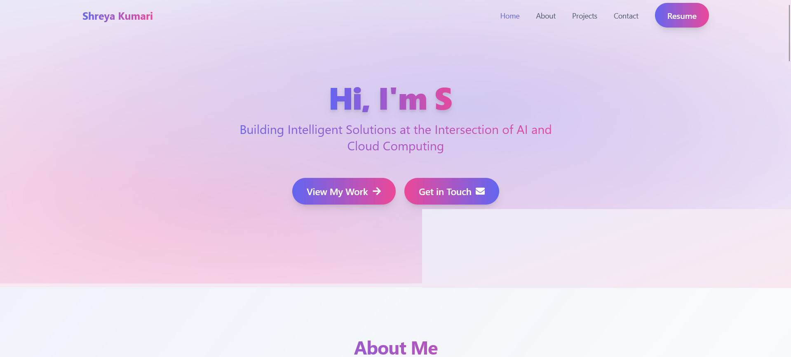
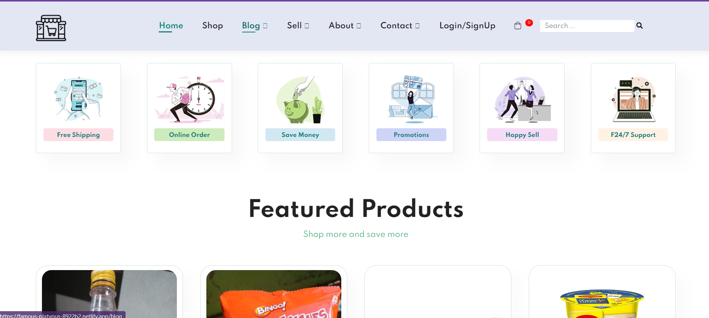

## Hi there 👋 

  

Welcome to my GitHub profile! I'm Shreya, and I'm excited to have you here. Here's a bit about me:

- 🔭 I’m currently working as a **Web Developer**.
- 🌱 I’m pursuing a degree in **Computer Science Engineering** with a specialization in **Cloud Computing**.
- 👯 I’m looking to collaborate on **Open Source Projects** and **Internships**.
- 💬 Feel free to ask me about **Web Development**!
- 📫 You can reach me on [LinkedIn](https://www.linkedin.com/in/shreya-k-955819221/)
- 🌐 **Personal Website**: A portfolio website showcasing my skills, projects, and blog.

  
  [Visit Here](https://shreyaportfolio0911.netlify.app/)

- 🛠️ **E-commerce Platform**: A e-commerce application.
  

[Visit Here](https://famous-platypus-8922b2.netlify.app/)

- 😄 Pronouns: **She/Her**
- ⚡ Fun fact: I'm a **fitness freak**! 🏋️‍♀️

Thanks for stopping by, and feel free to explore my repositories! 😊
